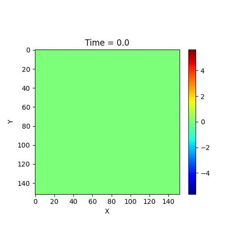
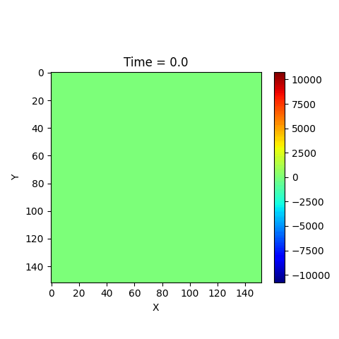

# ADSeismic: An Open Source High Performance Package for Automatic Differentiation (AD) based General Seismic Inversion


| Documentation                                                | Build Status                                                 |
| ------------------------------------------------------------ | ------------------------------------------------------------ |
| [](https://kailaix.github.io/ADSeismic.jl/dev/) | [](https://travis-ci.com/kailaix/ADSeismic.jl) |

ADSeismic is built for general seismic inversion problems, such as estimating velocity model, source location and time function. The package implements the forward FDTD (finite difference time domain) simulation of acoustic and elastic wavefields and enables flexible inversions of parameters in the wave equations using **automatic differentiation**. Several features of this package includes:

- **Battery included**: No adjoint state method codes required for building your own inversion models; Automatic differentiation is the work horse, making it unified approach to various seismic inversion problems such as full waveform inversion (FWI), earthquake location inversion, and source rupture inversion.
- **Neural Networks**: Easy to integrate Neural Networks (NN) into seismic inversion.
- **High performance**: Computational graph optimization using Tensorflow; Parallel computing using MPI.
- **(Multi-)GPU support**: Support for GPU acceleration as well as multi-GPU (in theory TPUs are also supported).

Examples can be found int these papers:

[A General Approach to Seismic Inversion with Automatic Differentiation](https://arxiv.org/pdf/2003.06027.pdf) 

[Integrating Deep Neural Networks with Full-waveform Inversion: Reparametrization, Regularization, and Uncertainty Quantification](https://arxiv.org/pdf/2012.11149.pdf)

[Distributed Machine Learning for Computational Engineering using MPI](https://arxiv.org/pdf/2011.01349.pdf)

[Learning generative neural networks with physics knowledge](https://link.springer.com/article/10.1007/s40687-022-00329-z)

## Installation

ADSeismic.jl requires proper installation of [ADCME.jl](https://github.com/kailaix/ADCME.jl/).
```julia
using Pkg
Pkg.add("ADCME")
```
This might take up to 20 minutes for complete installation. 

Then install this package (ADSeismic.jl) by 
```julia
using Pkg
Pkg.add("ADSeismic")
```

To enable GPU support, make sure `nvcc` is available on your machine, and then
```julia
using ADCME
use_gpu()
```
Use **has_gpu()** to check GPUs exist.

## Demo

- Acoustic Wave

Script: [AcousticWave.jl](./examples/demo/AcousticWave.jl)

Result: 

- Elastic Wave

Script: [ElasticWave.jl](./examples/demo/ElasticWave.jl)

Result: 
