# NNFWI 

**Integrating Deep Neural Networks withFull-waveform Inversion: Reparametrization, Regularization, and UncertaintyQuantification**
 
## Architecture
 

 
## Forward Simulation
 
| Marmousi model  | Inital model   |
| --------------- | -------------- |
| 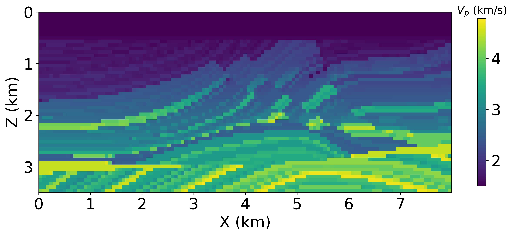 | 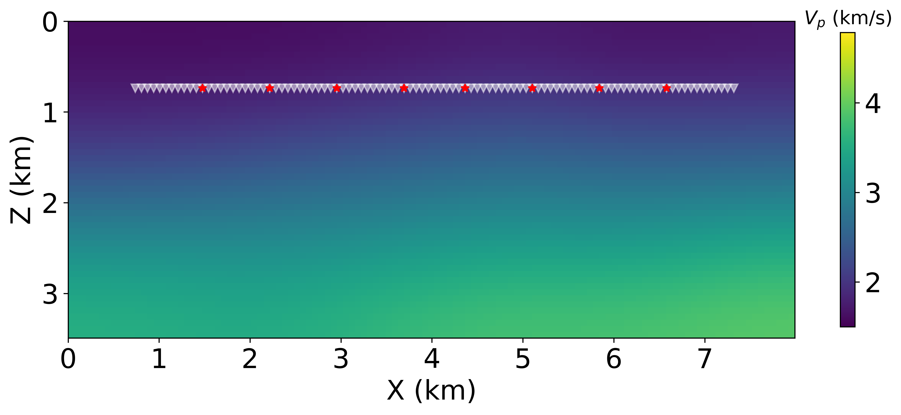 |

### Wavefield snapshot

 
## Inversion based on Automatic Differentiation
 
| noise | Traditional  FWI  | NNFWI             |
| ------| ----------------- | ----------------- |
| $\sigma=0$ | 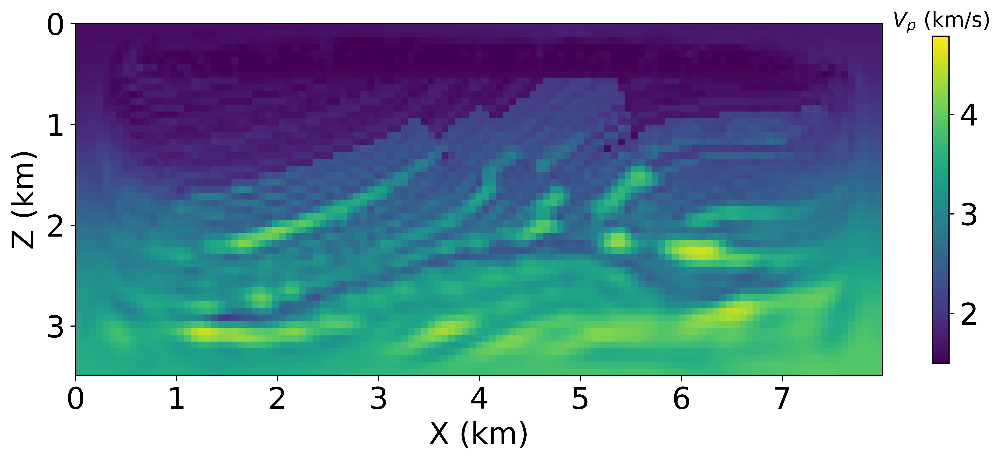 | 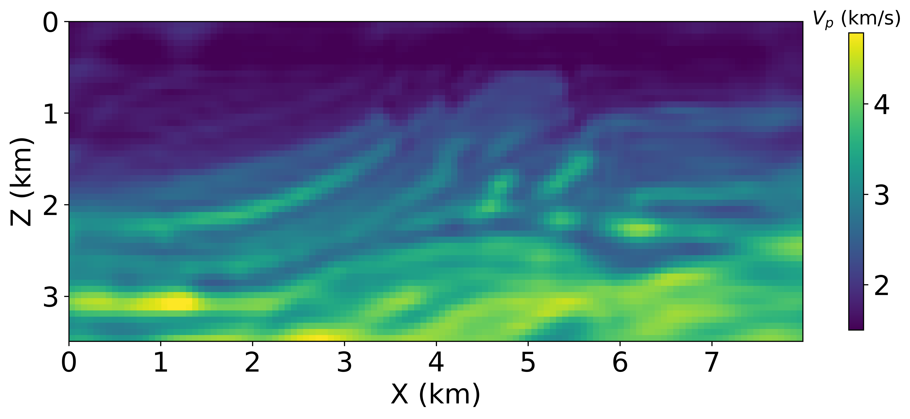 |
| $\sigma=1$ | 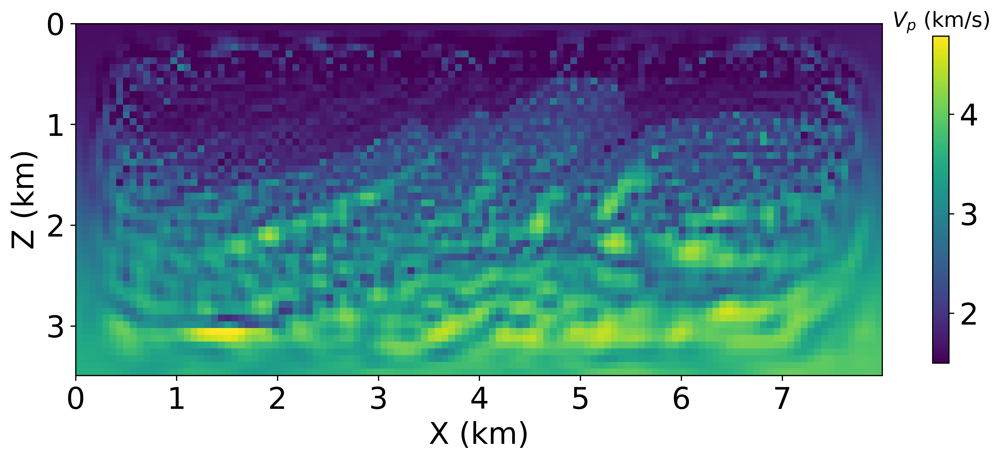 | 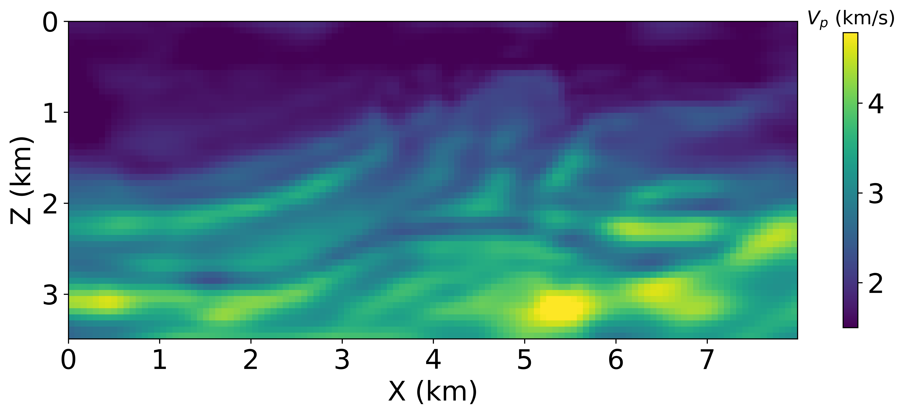 |
| $\sigma=2$ | 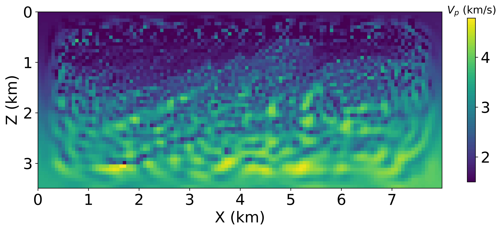 | 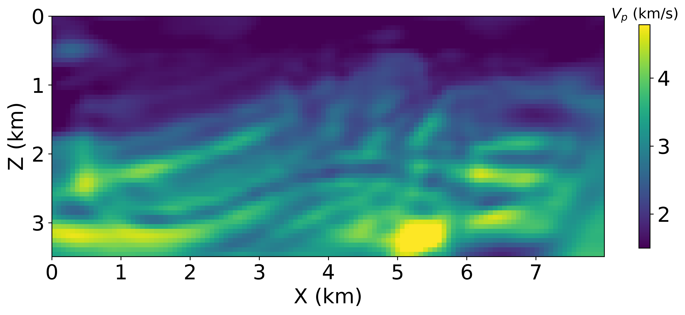 |
 
 
## Uncertainty quantification using Dropout

|   |   |
| - | - |
| Inverted $V_p$ | 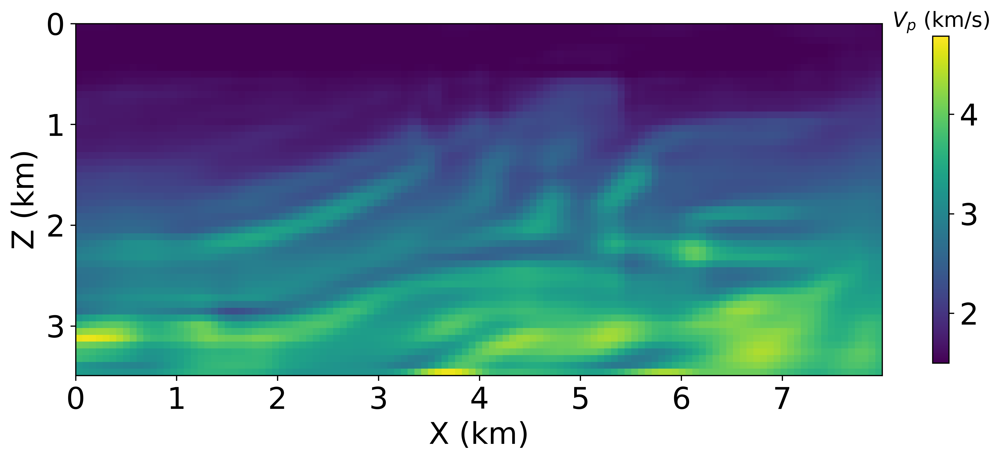    |
| std($V_p$) | 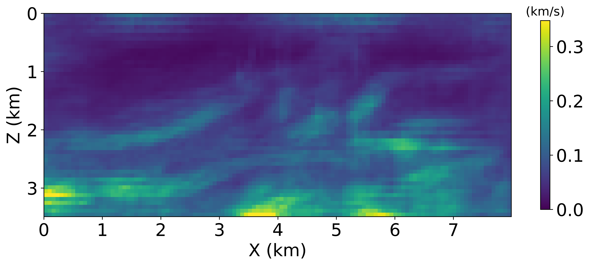 | 
| std($V_p$)/$V_p$ * 100% | 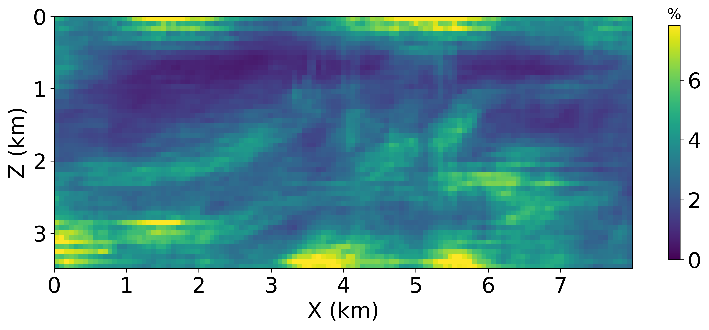 |

 
 
 

