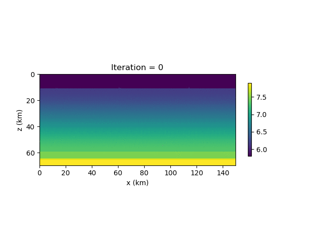
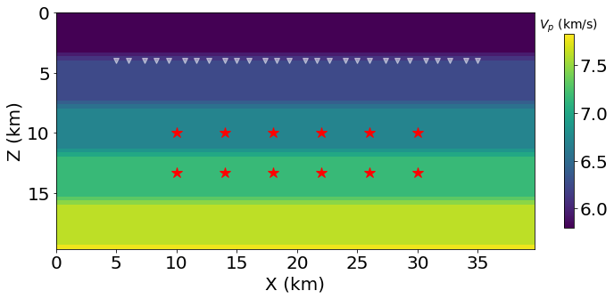
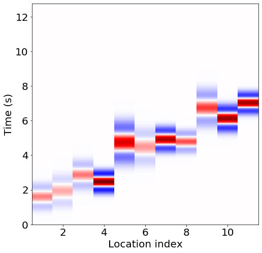
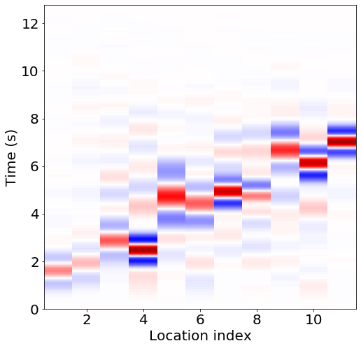
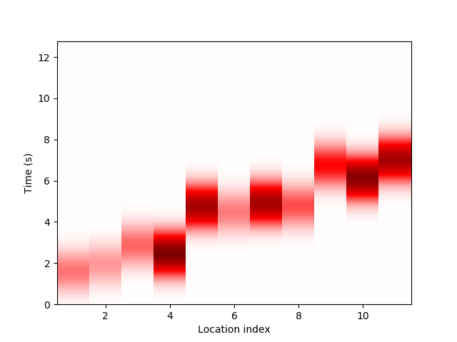

# Inversioin using Automatic Differentiation

In this section, we describe three inversion problems in seismic imaging: inverting velocity, inverting source location and time function, and inverting rupture process. 

Despite the method described here is also applicable to elastic wave equation, we consider the simpler the acoustic wave equation
$\begin{aligned} {u_{tt}} - {c^2}\Delta u =& f \\ u =& {u_0} \\ {u_t} =& {v_0} \end{aligned}$

Here $f$ is the source function, $u_0$ and $v_0$ are initial conditions. For numerical simulation, the perfect matched layer boundary condition is used to truncate the computational domain. See [Acoustic Wave Simulation](https://kailaix.github.io/ADSeismic.jl/dev/forward_simulation/#Acoustic-Wave-Simulation-1) for details. 

## Inverting Velocity Model

In this model, $c(x, y)$ is unknown. Red dots represent $n$ sources and triangles represent $m$ receivers at locations $\{\mathbf{x}_i\}$. We activate the sources one by one and collect the time serious signals $u(t, \mathbf{x}_i)$ at the receivers for different source functions. Therefore, the observations are $m$ $\mathbb{R}^{n_t\times n}$ matrices, where $n_t$ is the size of the time series. This inversion problem is called **full waveform inversion**, or FWI for short. 

The idea of FWI is updating $c(x, y)$ until the observations and the estimations--which are obtained from solving the wave equation--match. We do benchmarks on two classical models for $c(x,y)$: Marmousi model and Layer model. 

### Marmousi model


| Ground Truth                                                 | Inversion                                                    |
| ------------------------------------------------------------ | ------------------------------------------------------------ |
|  |  |


### Layer model


| Ground Truth                                                 | Inversion                                                    |
| ------------------------------------------------------------ | ------------------------------------------------------------ |
|  |   |



To invert the acoustic wave velocity, we first create three containers for storing simulation results, source functions and receiver data
```julia
ap_sim = load_acoustic_model("models/layer-model-smooth.mat"; inv_vp=true, IT_DISPLAY=0)
src = load_acoustic_source("models/layer-model-smooth.mat")
rcv_sim = load_acoustic_receiver("models/layer-model-smooth.mat")
```
Then we load ground truth receiver data
```julia
Rs = Array{Array{Float64,2}}(undef, length(src))
for i = 1:length(src)
    Rs[i] = readdlm(joinpath(output_dir, "layermodel-r$i.txt"))
end
```
Since we want to run the model on multi-GPU, we instruct ADSeismic to compute the gradients and loss on GPUs and then assemble them on CPU
```julia
vp = get_collection()[1]
losses, gs = compute_loss_and_grads_GPU(ap_sim, src, rcv_sim, Rs, vp) # losses and gs are computed on GPUs
g = sum(gs); loss = sum(losses) # g and loss are assembled on CPU
```
Finally, the optimization can be triggered by `LBFGS!`, a built-in L-BFGS optimizer
```julia
sess = Session(); init(sess)
LBFGS!(sess, loss, g, vp)
```


## Inverting Source Location and Time Function

In this case, the location and amplitude function of the source (we assume there is one single source) is not known. The receivers are placed on the earth surface. We want to estimate the source term $f$ based on the receiver information (which are $m$ time series in $\mathbb{R}^{n_t}$).

Mathematically, $f(t, \mathbf{x})$ is a Delta function in $\mathbf{x}$; to make the inversion problem continuous, we use 
```math
f_{\theta}(t, \mathbf{x}) = g(t) \frac{1}{2\pi\sigma^2}\exp(-\frac{\|\mathbf{x}-\theta\|^2}{2\sigma^2})
```
to approximate $f(t, \mathbf{x})$; here $\theta\in\mathbb{R}^2$ and $g(t)$ are unknown. 

| Source/Receiver Location                                     | Forward Simulation                                           |
| ------------------------------------------------------------ | ------------------------------------------------------------ |
| |  |

| Source Time Function Inversion                               |                  Source Location Inversion                    |
| ------------------------------------------------------------ | ------------------------------------------------------------ |
|  |  | 


## Inverting Rupture Process

### 1. Invert the rupture process directly

| Source/Receiver Location                                     | Forward Simulation                                           |
| ------------------------------------------------------------ | ------------------------------------------------------------ |
|  |  |

| Ground Truth                                                 | Inversion                                                    |
| ------------------------------------------------------------ | ------------------------------------------------------------ |
|  |  |


### 2. Inverte the slip time and amplitude

In this case, the functional form of the source function is known (see [`Gauss`](@ref))
```math
f(t) = \frac{2A}{\pi^2 a^2} \exp\left( -\frac{(t-t_0)^2}{\pi^2 a^2} \right)
```
where $A$ is the amplitude, $a$ is the parameter that controls width of the Gaussian, and $t_0$ is the shift of the parameter. 

| Ground Truth                                                 | Inversion                                                    |
| ------------------------------------------------------------ | ------------------------------------------------------------ |
|  |  |

