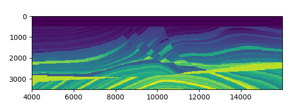
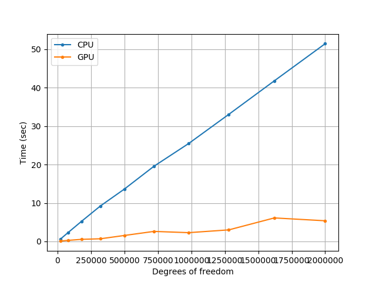

# Forward Simulation


In this section, we describe forward simulation for acoustic and elastic equations. 


## Acoustic Wave Simulation


We consider a time dependent wave field $u$ propagating through an unbounded domain $\mathbb{R}^2$. In $\Omega$, the wave field $u$ satisfies 

$\begin{aligned} {u_{tt}} - {c^2}\Delta u =& f \\ u =& {u_0} \\ {u_t} =& {v_0} \end{aligned}$

Here $f$ is the source function, $u_0$ and $v_0$ are initial conditions. 

We truncate the computational domain to a bounded 2D domain $\Omega\in \mathbb{R}^2$. To prevent the wave field to reflect from the boundaries, perfect matched layer (PML) are usually used to absorb the waves. Mathematically, the governing equation can be described by a modified partial differential equation (PDE) system with auxilliary variables $\phi$

$\begin{aligned}{u_{tt}} + ({\xi _1} + {\xi _2}){u_t} + {\xi _1}{\xi _2}u =& {c^2}\Delta u + \nabla  \cdot \phi   \\ {\phi _t} =& {\Gamma _1}\phi  + {c^2}{\Gamma _2}\nabla u\end{aligned}$

and $\Gamma_1$ and $\Gamma_2$ are defined by


$${\Gamma _1} = \left[ {\matrix{ { - {\xi _1}} & {}  \cr    {} & { - {\xi _2}}  \cr  } } \right],\quad{\Gamma _2} = \left[ {\matrix{{{\xi _2} - {\xi _1}} & {}  \cr    {} & {{\xi _1} - {\xi _2}}  \cr  } }\right]$$

The terms $\xi_i(x)\geq 0$, $i=1,2$ are the damping profiles and only depend on $x_i$ ($x=(x_1,x_2)$). In our example, we use


$${\xi _i}(x) = \left\{ {\matrix{{0\quad x\not  \in \tilde \Omega }  \cr    {{{\bar \xi }_i}\left( {{{d(x,\tilde \Omega )} \over {{L_i}}} - {{\sin \left( {{{2\pi d(x,\tilde \Omega )} \over {{L_i}}}} \right)} \over {2\pi }}} \right)\quad x \in\tilde \Omega }  \cr  } } \right.$$

 Here $L_i$ is the PML width in $x$ and $y$ direction and $\tilde \Omega_i$ is the domain excluding the PML layer in the $x$ (i=1) or $y$ (i=2) direction. $d(x, \tilde\Omega_i)$ is the distance between $x$ and $\tilde\Omega_i$. See the following figure for illustration. 


The profiling coefficient $\bar\xi_i$ is given by the relative reflection $R$ (we always use $R=0.001$), the (estimated) velocity of acoustic waves $c$ and the PML width $L_i$

```math
\bar\xi_i = \frac{c}{L_i}\log\left(\frac{1}{R}\right)
```

In what follows, we assume the velocity is given by the elastic Marmousi model. 



The following code snippet shows how we can run the forward simulation with the 13-th source function. For how to generate the dataset `marmousi2_model_big_true.mat`, we refer you to the notebooks. 


```julia
using ADSeismic
using ADCME
using PyPlot

matplotlib.use("agg")
model = load_acoustic_model("models/marmousi2_model_big_true.mat", IT_DISPLAY=50)
src = load_acoustic_source("models/marmousi2_model_big_true.mat")
rcv = load_acoustic_receiver("models/marmousi2_model_big_true.mat") # assume there is only one receiver

@assert length(src)==length(rcv)
for i = 1:length(src)
	SimulatedObservation!(model(src[i]), rcv[i])
end

sess = Session(); init(sess)
u = run(sess, model(src[13]).u)
visualize_file(u, model.param, dirs="$(@__DIR__)/../docs/src/asset/Acoustic")
```


The following animation shows the simulation result. 


## Elastic Wave Simulation

The governing equation for the elastic wave propagation is

$$\begin{aligned}\rho \frac{\partial v_z}{\partial t} =& \frac{\partial \sigma_{zz}}{\partial z} + \frac{\partial \sigma_{xz}}{\partial x}  \\\rho \frac{\partial v_x}{\partial t} =& \frac{\partial \sigma_{xx}}{\partial x} + \frac{\partial \sigma_{xz}}{\partial z}  \\  \frac{\partial \sigma_{zz}}{\partial t} =& (\lambda + 2\mu)\frac{\partial v_z}{\partial z} + \lambda\frac{\partial v_x}{\partial x}  \\  \frac{\partial \sigma_{xx}}{\partial t} =& (\lambda + 2\mu)\frac{\partial v_x}{\partial x} + \lambda\frac{\partial v_z}{\partial z}  \\  \frac{\partial \sigma_{xz}}{\partial t} =& \mu \frac{\partial v_z}{\partial x} + \lambda\frac{\partial v_x}{\partial z}\end{aligned}$$

Here 

| Variable                                | Description                                             |
| --------------------------------------- | ------------------------------------------------------- |
| $v_x, v_z$                              | Velocity of the wave field in the $x$ and $z$ direction |
| $\sigma_{xx}, \sigma_{zz}, \sigma_{xz}$ | Stress tensor                                           |
| $\rho$                                  | Density of the media                                    |
| $\lambda$                               | Lamé's first parameter                                  |
| $\mu$                                   | Shear modulus                                           |

The following animation shows the simulation result for $v_z$. 


## Benchmark of Acoustic Wave Simulation on CPU and GPU


We benchmark the simulation on CPU and GPU. The configuration for GPU and CPU are 

| CPU                                      | GPU                         |
| ---------------------------------------- | --------------------------- |
| Intel(R) Xeon(R) Gold 5118 CPU @ 2.30GHz | NVIDIA Tesla V100-PCIE-32GB |

The benchmark script can be found in [BenchmarkAcoustic.jl](https://github.com/kailaix/ADSeismic.jl/blob/master/test/BenchmarkAcoustic.jl) and [BenchmarkElastic.jl](https://github.com/kailaix/ADSeismic.jl/blob/master/test/BenchmarkElastic.jl).  

 The following shows the comparison of the simulation time for CPU and GPU. 

| Acoustic Simulation                 | Elastic Simulation                 |
| ----------------------------------- | ---------------------------------- |
|  |  |


## Multi-GPUs

With only a few modification to the original simulation codes, the model can also be run on multi-GPUs (see [AcousticMultiGPU.jl](https://github.com/kailaix/ADSeismic.jl/blob/master/test/AcousticMultiGPU.jl) for the full script). In this example, we compute the gradients of the loss function (the discrepancy between the observed seismic data and the simulated seismic data) with respect to the acoustic velocity. 

In the following code snippets, we explicitly place different source functions to different GPUs. This can be done with the  `@pywith tf.device("/gpu:0")` syntax, and the enclosed codes are executed on 0-th GPU.  

```Julia
using ADSeismic
using ADCME
using PyPlot
using PyCall
using DelimitedFiles
reset_default_graph()

src = load_acoustic_source("models/marmousi2_model_initial.mat")
ep_sim = load_acoustic_model("models/marmousi2_model_initial.mat"; inv_vp=true, IT_DISPLAY=0)
rcv_sim = load_acoustic_receiver("models/marmousi2_model_initial.mat")


Rs = Array{Array{Float64,2}}(undef, length(src))
for i = 1:length(src)
    Rs[i] = readdlm("models/AcousticData/Acoustic-R$i.txt")
end


function run_on_gpu_device(batch_id)
    local loss, g
    @pywith tf.device("/gpu:$(batch_id-1)") begin
        [SimulatedObservation!(ep_sim(src[i]), rcv_sim[i]) for i = batch_id]
        loss = sum([sum((rcv_sim[i].rcvv-Rs[i])^2) for i = batch_id]) 
        g = gradients(loss, get_collection()[1])
    end
    return loss, g
end

losses = Array{PyObject}(undef, 8)
gs = Array{PyObject}(undef, 8)
for i = 1:8
    losses[i], gs[i] = run_on_gpu_device(i)
end
g = sum(gs)
sess = Session(); init(sess)
run(sess, g)
```

The following plot shows the dataflow of the above computation. 


We take the snapshot of `nvidia-smi` and it shows the memory and computation utilization of GPUs on a DGX server with 8 Tesla V100s 


