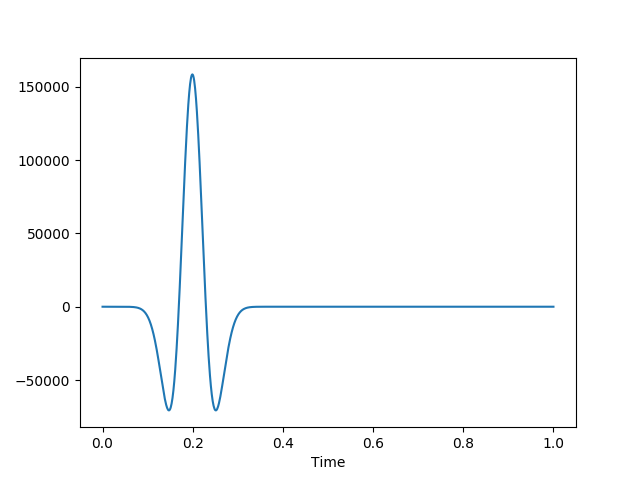

# Getting Started

**An Open Source High Performance Package for General Seismic Inversion Problems**


ADSeismic is suitable for general inversion problems in seismic imaging. The packages implements the forward simulation of acoustic and elastic wave fields and allows inversion of physical properties such as media densities, Lamé parameters, shear modulus, etc. by means of **automatic differentiation**. For example, the following problems fall into the scope of this framework

- Full waveform inversion (FWI)
- Rupture inversion
- Source-time inversion

The package provides a unified interface for both acoustic and elastic wave simulation. Users only need to specify the geometries and known parameters of the physical simulation. Gradients (traditionally derived by adjoint methods) are computed automatically. Some notable features of this package are

- **Battery included**: unified approach to various seismic inversion problems such as full waveform inversion (FWI), rupture inversion and source-time inversion.
- **High performance**: computational graph optimization and parallel computing. 
- **(Multi-)GPU support**: support for GPU acceleration as well as multi-GPU (in theory TPUs are also supported).
- **Easy-to-use**: no adjoint state method codes required for building your own inversion models; automatic differentiation is the workhorce.

ADSeismic is built on [ADCME.jl](https://github.com/kailaix/ADCME.jl/), an automatic differentiation library for computational mathematics and engineering. The former is fully compatible with ADCME.jl, which indicates that this package (ADSeismic.jl) can serve as a acoustic/elastic simulation solver in a system inverse modeling problem. 

## Installation

`ADCME` is a dependency for using this package. Install `ADCME` with
```julia
using Pkg; Pkg.add("ADCME")
```

Then install the lastest ADSeismic.jl by
```julia
using Pkg; Pkg.add("https://github.com/kailaix/ADSeismic.jl#master")
```
or the stable version by 
```julia
using Pkg; Pkg.add("ADSeismic")
```

If you want to use GPU for ADSeismic, you need to install the GPU-capable ADCME. See instructions [here](https://kailaix.github.io/ADCME.jl/latest/tu_customop/#Install-GPU-enabled-TensorFlow-(Linux-and-Windows).


## Simple Example: Acoustic Wave Equation 

We consider the acoustic wave equation 

$$\frac{\partial^2 u }{\partial t^2} = \nabla \cdot (c^2 \nabla u) + f$$

where $u$ is the displacement, $f$ is the source term, and $c$ is the spatially varying acoustic velocity. In numerical simulations, we apply the perfect matched layer (PML) boundary conditions so that the outgoing waves are damped near the boundary. This enables us to emulate an infinite space using a finite computational domain. A description of the numerical scheme could be found in this paper. [^pml]

[^pml]: Grote, Marcus J., and Imbo Sim. "Efficient PML for the wave equation." arXiv preprint arXiv:1001.0319 (2010).

In the forward simulation, we consider a layer model as the ground truth for $c$, which consists of three layers with different values:


We consider a delta source function $f(\mathbf{x}, t) = \delta(\mathbf{x}-\mathbf{x}_0)g(t)$, where $g(t)$ is a Ricker wavelet. 

Using this source function (left plot), we are able to generate the wavefield (right plot)


| Source Function      | Wavefield |
| ----------- | ----------- |
|       |        |

The code for forward simulation is as follows:

```julia
using ADCME
using ADSeismic
using PyPlot
using DelimitedFiles
using JLD2 

scale = 201
 
param = AcousticPropagatorParams(NX=scale, NY=scale, 
    NSTEP=1000, DELTAT=1e-4,  DELTAX=1.0, DELTAY=1.0,
    PropagatorKernel = 0, Rcoef = 1e-8)

rc = Ricker(param, 30.0, 200.0, 1e6)
srci = [div(param.NX,2)]
srcj = [div(param.NY,5)]
srcv = reshape(rc, :, 1)
src = AcousticSource(srci, srcj, srcv)

layers = ones(param.NX+2, param.NY+2)
n_piece = div(param.NX + 1, 3) + 1
for k = 1:3
    i_interval = (k-1)*n_piece+1:min(k*n_piece, param.NX+2)
    layers[:, i_interval] .= 0.5 + (k-1)*0.25
end

C = placeholder(3300*layers)
model = AcousticPropagatorSolver(param, src, C^2)

sess = Session(); init(sess)
u = run(sess, model.u)
```


In the inverse problem, we assume we can observe the wavefield $u(x, 40, t)$ for all $x$ and $t$. The unknown is the velocity model $c$. We can find the value of $c$ by solving the PDE-constrained optimization problem 

$$\begin{aligned} \min_c &\; \sum_{} (u_h(x_i, 40, t_j) - u(x_i, 40, t_j))^2 \\ \text{s.t.} &\; F_h(u_h, c) = 0\end{aligned}$$

Here $F_h(u_h, c)=0$ is the numerical discretization of the wave equation and $u_h$ is the numerical solution for **all** time steps. The following plot shows the signal we received:


We can apply automatic differentiation with the following code to calculate the gradients of the loss function with respect to $c$

```julia
using ADCME
using ADSeismic
using PyPlot
using DelimitedFiles
using JLD2 

scale = 201
 
param = AcousticPropagatorParams(NX=scale, NY=scale, 
    NSTEP=1000, DELTAT=1e-4,  DELTAX=1.0, DELTAY=1.0,
    PropagatorKernel = 0, Rcoef = 1e-8)

rc = Ricker(param, 30.0, 200.0, 1e6)
srci = [div(param.NX,2)]
srcj = [div(param.NY,5)]
srcv = reshape(rc, :, 1)
src = AcousticSource(srci, srcj, srcv)


C = Variable(3300*ones(param.NX+2, param.NY+2))
model = AcousticPropagatorSolver(param, src, C^2)
@load "data.jld2" u 

U = model.u
loss = sum((u[:, :, 40] - U[:,:,40])^2)
g = gradients(loss, C)

sess = Session(); init(sess)
G = run(sess, g)
```

The gradient at the first step is shown below:


The codes can be found [here](https://github.com/kailaix/ADSeismic.jl/tree/master/examples/benchmark0223).